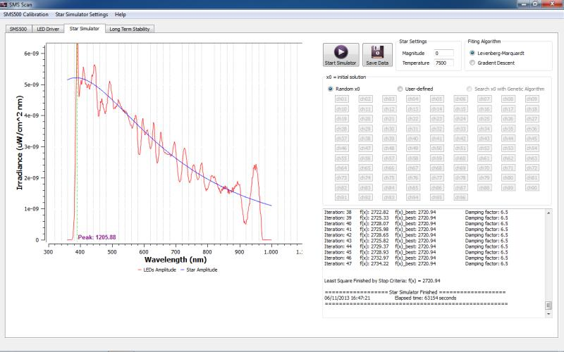
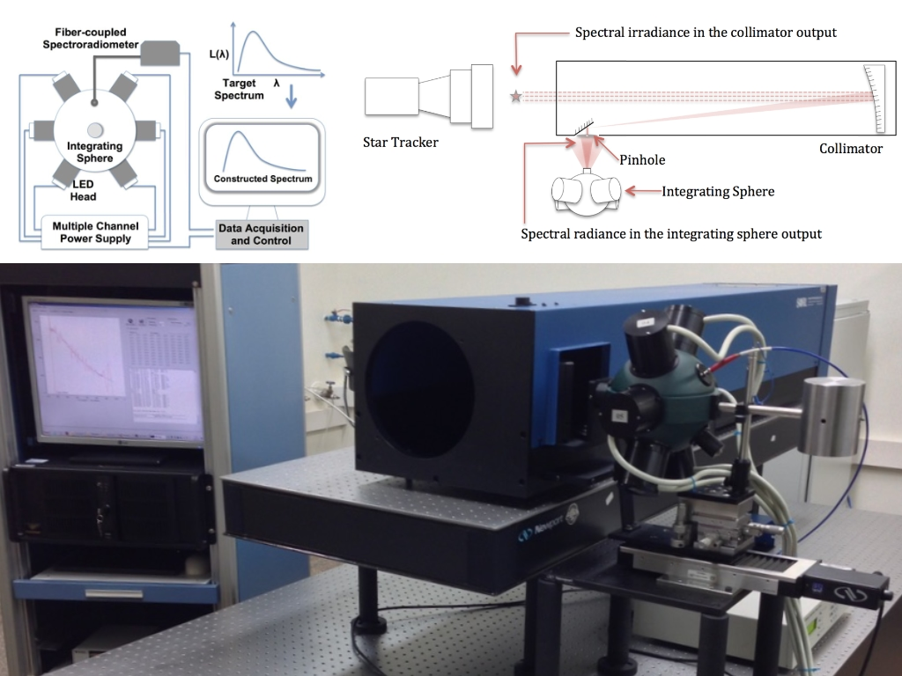

# Star Simulator for Star Tracker Calibration

![C++][cpp-shield] ![Qt][qt-shield]

This repository hosts a **Qt C++ application** for controlling the Star Simulator System and the SphereOptics SMS-500 Spectral Measurement Sensor. It enables calibration of the Star Tracker currently under development at the **National Institute for Space Research (INPE)**.



## Star Simulator

The star simulator consists of an **LED-based spectrally tunable light source**, a **pinhole**, and a **collimator**. It can generate different continuum spectral distributions, simulating star magnitudes in the **visible and near-infrared range**, achieved through feedback control of the individual LEDs.



## Reference

The code was developed as part of my **Master's thesis**, defended in December 2013 (in Portuguese).

An English version of the related work is also available [on ResearchGate][article-geo]:

**Generalized Extremal Optimization Algorithm to design a LED-based spectrally tunable light source for Star Simulation**

If you find this work useful, please consider citing it as:

```bibtex
@article{borges2013geo,
  title={Generalized Extremal Optimization Algorithm to design a LED-based spectrally tunable light source for Star Simulation},
  author={Borges, Marcos and Guimaraes, Lamartine Nogueira Frutuoso},
  journal={Journal of Computational Interdisciplinary Sciences},
  volume={4},
  number={2},
  pages={1--12},
  year={2013}
}
```

## Author

[Marcos Borges, PhD](https://marcosborges.phd)

<!-- LINKS -->
[cpp-shield]: https://img.shields.io/badge/Language-C++-blue.svg
[qt-shield]: https://img.shields.io/badge/Framework-Qt5-green.svg
[article-geo]: https://www.researchgate.net/publication/282052518_Generalized_Extremal_Optimization_Algorithm_to_design_a_LED-based_spectrally_tunable_light_source_for_Star_Simulation

